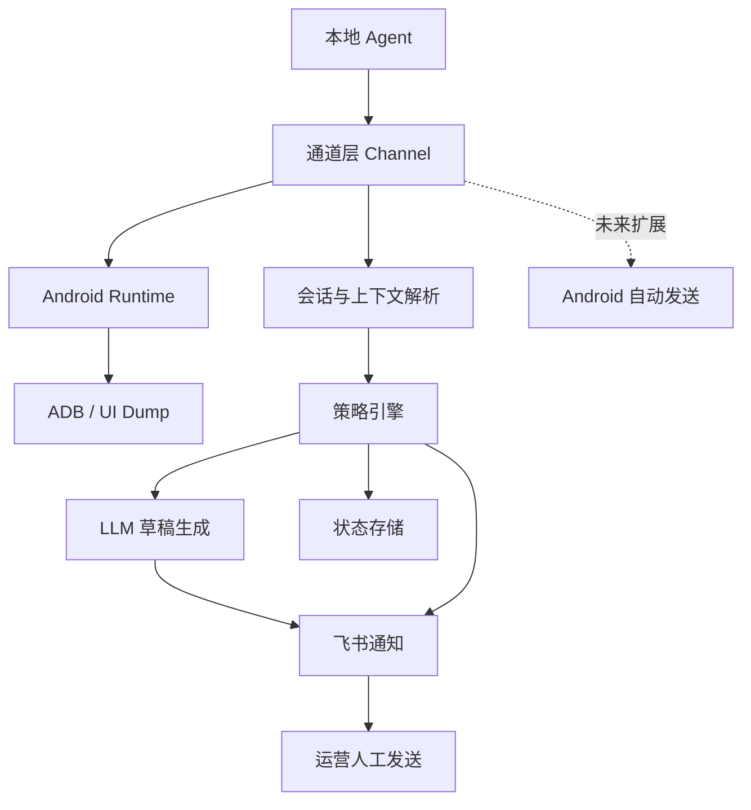
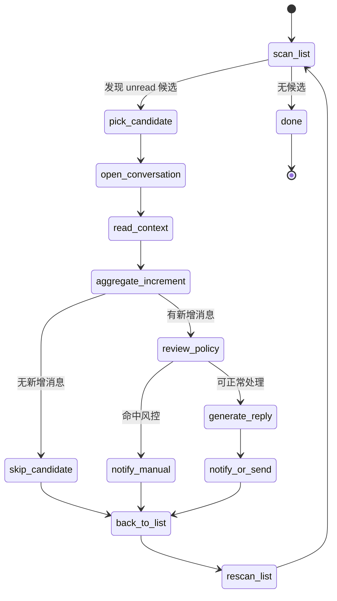

# 技术方案 - 小红书私信助手

| 字段 | 值 |
| --- | --- |
| Tech Lead | 待补充 |
| Product Manager | 待补充 |
| Team | 待补充 |
| Epic/Ticket | 待补充 |
| Status | Draft |
| Created | 2026-04-14 |
| Last Updated | 2026-04-14 |

## 1. 背景

当前仓库已经从“Web 私信助手”调整为“基于 Android 真机执行的小红书私信 AI 辅助系统”。产品规划明确了现阶段的可用主链路是 Android 设备，不再将 Web 视为当前可交付能力；当前 MVP 目标也不是全自动回复，而是先稳定实现“发现私信、读取上下文、生成 AI 草稿、通知运营、人工发送”的闭环。

从代码实现看，系统已经具备统一通道抽象、Android 设备接入、UI dump 解析、消息去重、风险关键词转人工、飞书通知和大模型草稿生成能力。当前真正制约产品进入可交付阶段的，不是模型生成能力，而是 Android UI 解析稳定性、设备异常恢复、运行状态可观测性，以及面向外部客户的安装与运维体验。

该方案面向当前仓库现状，目标是明确 V1 到自动发送 Beta 的技术架构、关键约束、模块边界和演进路径，避免产品规划与实现方向继续出现偏差。

## 2. 问题定义与动机

### 2.1 要解决的问题

- **问题 1：私信发现不稳定**
  - 影响：如果依赖人工刷新手机或网页查看，容易漏掉新私信，直接影响线索承接和响应时效。
- **问题 2：首轮回复效率低**
  - 影响：运营人员需要频繁处理高重复度问询，手工构思首轮回复耗时高且质量不稳定。
- **问题 3：当前技术链路缺少产品级稳定性**
  - 影响：即使读取和草稿生成已经可用，缺少设备恢复、状态可视化和交付规范，仍不足以支撑对外试点交付。

### 2.2 为什么现在做

- 产品规划已经明确 Android 真机是当前唯一真实可用主链路，需要把研发投入集中到 Android 稳定性，而不是继续围绕 Web 做假设。
- 仓库已经具备 Phase 0 的核心代码骨架，继续补齐稳定性与交付能力的投入产出比最高。
- Android 自动发送被定义为下一阶段唯一核心能力，需要先在当前读取链路上补足风险控制、监控和回滚机制。

### 2.3 不做的代价

- **业务侧**：继续漏消息，首轮回复慢，无法承接外部客户试点。
- **技术侧**：通道抽象会继续偏离真实产品重心，后续自动发送和客户交付成本更高。
- **交付侧**：系统停留在“开发者可运行”的原型阶段，无法形成可复制的交付方案。

## 3. 范围

### 3.1 In Scope

本方案覆盖以下内容：

- 基于 Android 真机的私信监听主链路
- 会话发现、上下文提取、AI 草稿生成、飞书通知、人工发送闭环
- 本地状态存储、去重、冷却时间和人工审核策略
- 面向 Android 自动发送 Beta 的架构预留与风险控制
- 运行日志、异常分类、监控指标、回滚与实施计划

### 3.2 Out of Scope

当前方案不包含以下内容：

- Web 私信能力产品化恢复
- 多账号调度与矩阵号管理
- 后台管理系统或 CRM 能力
- 云端 SaaS 化部署
- 飞书内审批工作流、指令回写和复杂人机协作流

### 3.3 后续阶段

- Android 自动发送 Beta
- 外部客户安装包、设备绑定和审计能力
- 设备管理面板、远程日志和轻量控制台

## 4. 技术目标与非目标

### 4.1 技术目标

- 在单设备单账号场景下稳定执行 Android 私信读取链路
- 对未读会话生成高可用中文回复草稿并通知到飞书
- 通过状态去重、冷却时间和风险关键词识别降低误处理
- 为 Android 自动发送能力预留统一的通道能力接口
- 为外部试点交付建立最小可观测、可恢复、可排障的基础能力

### 4.2 非目标

- 不在当前阶段提供完全自动化客服能力
- 不在当前阶段提供高并发、多租户或多区域部署能力
- 不要求在当前阶段实现复杂数据库建模或控制台产品

## 5. 现状架构与缺口

### 5.1 当前实现概览

当前仓库采用 Node.js 单进程轮询架构，核心流程如下：

1. 进程启动后校验运行时配置并加载本地状态。
2. 根据 `XHS_CHANNEL` 选择通道实现，当前主用 `android`。
3. 通道创建运行时对象，Android 场景下负责检查设备连接、启动 App。
4. 定时拉取会话列表，筛选未读会话。
5. 对每个未读会话读取上下文，计算消息哈希和会话状态键。
6. 命中风险规则或冷却规则时，转人工并发送飞书通知。
7. 否则调用兼容 OpenAI Chat Completions 的模型接口生成草稿。
8. 当前默认仅发送飞书通知，由人工在手机端完成最终发送。
9. 每轮处理后持久化本地状态。

### 5.2 当前主要缺口

- Android UI 解析对页面布局变化敏感，缺少稳定性保护和版本兼容策略。
- 设备断连、App 未在目标页、ADB 卡死等异常没有成体系恢复流程。
- 状态只保存在本地 JSON，缺少任务历史、审计记录和指标聚合。
- 当前日志是标准输出级别日志，缺少结构化字段与告警阈值。
- 自动发送能力接口已预留，但缺少输入框定位、发送确认、失败重试和误发保护。
- 未读会话的处理策略还不够严格，当前实现更接近“拿到一批未读会话后顺序处理”，但没有把“处理完当前会话后必须退回消息列表，再重新确认下一个未读会话”的导航协议固化为明确设计。
- 同一会话内用户可能连续发送多条消息，当前系统虽然会读取最近历史，但文档中还没有明确“回复对象应基于该会话当前未处理消息集合，而不是只机械处理单条 unread 标记”的业务约束。
- 当前消息列表抓取能力只覆盖首屏附近少量会话候选，无法完整覆盖真实场景中的全部未读会话，需要补充滚动扫描与优先级调度策略。

## 6. 技术方案

### 6.1 架构总览

方案保持当前“本地 Agent + Android 真机 + 外部依赖 API”的部署形态，继续采用单进程轮询架构，但把能力边界明确拆分为四层：

- **执行层**：Android 设备、ADB 通信、UI dump 获取、界面操作。
- **业务层**：会话发现、上下文提取、策略判断、草稿生成、状态去重。
- **交互层**：飞书通知、人工处理入口、后续自动发送能力。
- **交付层**：配置管理、日志与监控、安装部署、故障恢复。



### 6.2 核心模块设计

#### 通道层

- `channel.js` 负责根据配置选择消息通道。
- `channels/android.js` 定义 Android 主链路，实现运行时创建、会话读取、上下文读取。
- `channels/web.js` 继续保留为接口抽象，不计入当前可交付能力。

设计原则：

- 通道层暴露统一能力接口：`createRuntime`、`listUnreadConversations`、`openConversation`、`readConversationContext`、`sendReply`、`closeRuntime`。
- 业务主循环不感知 Android 或 Web 具体实现，便于后续仅替换通道实现扩展自动发送。

#### Android 执行层

- `android-adb.js` 负责设备发现、App 启动、UI dump、点击操作。
- `android-ui.js` 负责解析 XML 树、提取会话列表、提取消息上下文。

设计原则：

- UI 读取与 UI 解析分层，便于保留原始 dump 做调试和回归测试。
- 所有自动交互必须基于可追溯的 UI 节点定位结果，而不是硬编码时间延迟驱动。

#### 业务编排层

- `index.js` 是轮询与处理编排入口。
- `policy.js` 提供人工审核和冷却判断。
- `llm.js` 负责调用模型生成草稿。
- `state-store.js` 提供本地状态持久化。

设计原则：

- 一轮轮询必须可恢复、可跳过已处理消息、可按会话独立失败。
- 单会话失败不能影响整轮轮询。
- 未读会话必须串行处理，且顺序以当前消息列表从上到下为准。
- 每完成一个会话的处理，必须显式返回消息列表页，再重新抓取列表，避免因已读状态变化、会话位置变化或 UI 重排导致后续会话点击错位。
- 调度必须优先保证首屏高位未读的响应时效，同时通过补偿扫描逐步覆盖深层未读。

#### 通知层

- `notifier.js` 统一封装通知消息格式。
- `feishu.js` 同时支持飞书应用消息和 webhook 两种模式。

设计原则：

- 通知失败不阻断主流程，但必须记录错误。
- 通知文本必须覆盖会话名、用户消息摘要、AI 草稿、处理方式和人工原因。

### 6.3 目标流程

#### V1 流程：监控 + 草稿 + 通知 + 人工发送

1. 本地 Agent 启动并校验配置。
2. 连接 Android 设备，唤起小红书 App。
3. 抓取消息页 UI dump 并解析未读会话列表，将 `unread = true` 会话视为“待处理候选队列”。
4. 从当前列表中按从上到下顺序选择第一个候选会话并进入详情页。
5. 读取该会话完整上下文，计算“自上次处理后新增的用户消息增量”。
6. 若同一用户连续发送多条消息，则将这批新增消息聚合为同一次回复输入，而不是逐条触发独立回复。
7. 若该候选会话没有实际消息增量，则标记为“已检查无需处理”，返回消息列表继续下一个候选会话。
8. 若存在消息增量，则对该会话执行去重和风控规则判定。
9. 调用大模型生成一次回复草稿。
10. 把处理结果推送到飞书，或在后续阶段执行自动发送。
11. 当前会话处理结束后，必须返回消息列表页。
12. 重新抓取消息列表并重算候选队列，再继续选择新的第一个候选会话。
13. 重复上述过程，直到当前列表中不存在待处理候选，或所有候选都已确认无新增消息。
14. 运营在手机端人工完成最终发送。

#### 全已读场景处理规则

如果当前消息列表中不存在任何 `unread = true` 的候选会话，则本轮应直接结束，不执行后续会话处理动作：

1. 不进入任何会话详情页。
2. 不调用 LLM。
3. 不发送业务通知。
4. 记录一次“本轮无候选”的运行日志。
5. 等待下一个轮询周期再重新扫描。

#### 候选会话 + 增量消息处理协议

为避免把 UI 红点误当成唯一业务真相，V1 和 V2 都必须遵循以下协议：

1. **候选规则**：`unread = true` 只表示候选会话，不直接等价于“必须立即回复”。
2. **顺序规则**：候选会话按消息列表当前视觉顺序从上到下处理。
3. **单会话闭环**：一次只处理一个候选会话，不允许在未返回列表前并行切换到其他会话。
4. **增量规则**：进入会话后必须基于会话上下文计算“未处理消息增量”，而不是只依据列表红点做回复决策。
5. **消息聚合规则**：若同一会话在一次处理周期内存在多条连续用户消息，则这些消息应被视为单次回复上下文的一部分。
6. **空增量跳过规则**：候选会话若无实际消息增量，则应跳过回复，返回列表继续处理下一个候选。
7. **返回列表规则**：当前会话处理完毕后，必须执行返回动作，确认已回到消息列表页。
8. **重新抓取规则**：每次返回列表后，必须重新抓取 UI dump 并重新计算候选队列，不能复用上一次列表快照直接按旧索引点击。
9. **完成判定**：只有当重新抓取后的列表中不存在候选会话，或所有候选会话都被确认无新增消息时，当前轮询才算完成。

#### 推荐状态机

开发实现建议使用显式状态机，而不是把流程散落在若干 if/else 中：



状态定义：

- `scan_list`：抓取当前消息列表并生成候选队列。
- `pick_candidate`：按从上到下顺序选取第一个候选会话。
- `open_conversation`：进入目标会话详情。
- `read_context`：读取会话上下文与最近消息。
- `aggregate_increment`：识别自上次处理后新增的用户消息并聚合。
- `skip_candidate`：候选会话无新增消息，直接跳过。
- `review_policy`：执行冷却和风险策略判断。
- `notify_manual`：转人工并通知。
- `generate_reply`：生成草稿。
- `notify_or_send`：通知飞书，或在后续阶段执行自动发送。
- `back_to_list`：返回消息列表并确认返回成功。
- `rescan_list`：重新抓取列表，进入下一轮候选计算。

#### 两级调度策略：首屏优先 + 深层补偿

考虑到当前 Android 列表解析只能稳定覆盖首屏附近少量会话候选，而真实场景可能持续有新私信占据高位，推荐采用两级调度策略而不是一次性深扫全列表。

##### Tier 1：首屏高优先级队列

- 扫描当前首屏或前两屏可稳定识别区域。
- 所有高位 `unread = true` 候选优先处理。
- 每处理完一个候选会话后，立即返回列表并重新抓取首屏。
- 只要首屏重新出现新的高优先级未读，始终优先处理 Tier 1。

##### Tier 2：深层补偿队列

- 当 Tier 1 暂时为空，或达到预设补偿窗口时，向下探测额外 1 到 2 屏。
- 把新发现的深层候选加入补偿队列。
- 补偿队列只作为低优先级待处理池，不抢占首屏最新会话。

##### 抢占规则

- 深层补偿扫描过程中，如果首屏出现新的 `unread = true` 候选，应立即中断深扫。
- 中断后先回到列表顶部，恢复 Tier 1 调度。
- 只有当 Tier 1 再次为空时，才继续处理 Tier 2。

##### 防饿死规则

为了避免深层旧未读长期得不到处理，需要增加补偿配额：

- 每处理完 3 到 5 个 Tier 1 候选，允许处理 1 个 Tier 2 候选。
- 或每隔固定轮询轮次执行一次受限深扫。
- 深扫和补偿处理都必须设置时间与数量上限，防止长期占用主循环。

##### 扫描停止条件

深层补偿扫描建议满足任一条件即停止：

- 连续 2 到 3 次滑动未发现新候选。
- 触达预设最大扫描屏数。
- 达到单轮扫描耗时上限。
- Tier 1 出现新的高优先级未读。

##### 为什么不建议一次性全量深扫

- 新私信会持续占领高位，深扫期间处理的可能只是较旧未读。
- Android UI 列表会频繁重排，深扫时间越长，候选快照越不可信。
- 业务价值上应优先响应最新私信，而不是追求一次扫描所有历史未读。

#### 为什么不直接采用“见 unread 就回复”

从技术治理角度，不建议把 `unread = true` 直接当成回复触发器，原因如下：

- `unread` 是 UI 信号，不是持久化业务状态，可能受页面缓存、已读同步时机和列表刷新影响。
- 同一会话可能存在历史未读残留，但本轮并没有新的有效用户输入。
- 同一会话内多条连续用户消息更适合聚合后一次回复，而不是按 unread 触发多次回复。
- 真正的幂等依据应是消息增量和消息哈希，而不是列表红点本身。

#### 对当前实现的评估

按照上述协议，当前实现仍有五个需要在开发时重点补齐的点：

- 业务主循环需要把“返回消息列表并重新抓取候选列表”作为显式步骤，而不是默认假设旧的未读快照仍然有效。
- 会话处理需要引入“消息增量识别”步骤，避免把 `unread = true` 直接等价为“必须回复”。
- 会话处理需要把“连续多条用户消息”定义为同一次待回复输入，避免只针对最新单条消息给出回复，造成上下文遗漏。
- 列表扫描需要补充“全已读立即结束本轮”的显式分支，避免空转进入无意义处理流程。
- 列表扫描需要从“只看首屏候选”升级为“首屏优先 + 深层补偿”的两级调度模型，兼顾最新消息响应和深层未读覆盖。

#### V2 流程：受控自动发送 Beta

在 V1 基础上增加以下步骤：

1. 风险规则通过后进入自动发送前校验。
2. 定位输入框并填充草稿。
3. 定位发送按钮并执行发送。
4. 再次抓取 UI，确认消息已出现在会话中或出现成功态。
5. 写入发送结果、失败原因和回退状态。

### 6.4 外部接口契约

#### 大模型接口

- 类型：兼容 OpenAI Chat Completions 的 HTTP API
- 路径：`POST /chat/completions`
- 输入：
  - system prompt
  - 会话标题
  - 最新消息
  - 最近历史消息数组
- 输出：
  - 单条中文回复草稿

约束：

- 模型返回为空视为失败。
- 需要支持替换模型和兼容第三方 OpenAI 风格接口。

#### 飞书通知接口

- 模式 1：飞书应用消息
- 模式 2：Webhook
- 输出内容：
  - 会话标题
  - 用户消息摘要
  - AI 草稿
  - 处理方式
  - 转人工原因（如果有）

#### ADB 设备能力

- 设备发现
- App 拉起
- UI dump
- 屏幕点击
- 后续扩展输入文本与发送确认

### 6.5 数据模型

当前阶段继续采用文件型本地状态，避免过早引入数据库。

#### 本地状态结构

```json
{
  "conversations": {
    "<conversationStateKey>": {
      "lastHandledMessageHash": "sha1",
      "lastHandledAt": "ISO-8601",
      "lastReplyText": "string",
      "mode": "draft-only | manual-review | auto-send"
    }
  }
}
```

#### 运行时对象

- `runtime.adbPath`
- `runtime.deviceId`
- `runtime.packageName`
- `runtime.launcherActivity`

后续演进建议：

- Phase 2 开始引入“任务执行记录”结构，记录每次轮询、会话处理结果和错误类型。
- Phase 3 若进入外部交付，再评估迁移到 SQLite 或轻量嵌入式数据库。

### 6.6 关键设计决策

#### 决策 1：继续保留通道抽象，但产品只承认 Android 主链路

- 原因：当前 Web 不具备真实交付价值，但统一接口对自动发送和未来恢复 Web 有收益。
- 结果：文档和产品表述统一为“Web 仅保留抽象，不属于当前可用能力”。

#### 决策 2：默认人工发送，不直接切自动发送

- 原因：产品规划明确稳定性优先于自动化，且当前 Android 发送链路尚未实现。
- 结果：AI 在当前阶段只输出草稿并通过飞书触达运营。

#### 决策 3：状态先使用本地文件而不是数据库

- 原因：当前部署模型是一客户一设备一本地 Agent，JSON 状态足够支撑去重与冷却。
- 结果：短期保持低复杂度，后续在外部交付阶段再考虑审计和多维查询能力。

#### 决策 4：先保证单设备单账号闭环，不做多账号调度

- 原因：这是产品规划中最明确的交付约束，也是控制复杂度和支持成本的关键。
- 结果：所有监控、日志、部署说明都围绕“一客户一设备一账号”设计。

#### 决策 5：候选会话必须采用“处理一个，返回列表，重算队列，再取下一个”的串行导航模型

- 原因：Android 消息列表会因为会话已读、收到新消息、置顶变化或页面重排而改变顺序，复用旧列表索引存在高风险。
- 结果：处理链路必须在每个会话结束后重新回到列表页并重新抓取候选列表，把队列重算作为协议的一部分，而不是实现细节。

#### 决策 6：真正的回复触发条件是“存在未处理消息增量”，而不是单纯 `unread = true`

- 原因：`unread = true` 只是一种 UI 提示，不具备足够稳定的业务语义，不能单独承担幂等与回复触发判断。
- 结果：列表红点只用于发现候选会话，真正是否回复由会话内消息增量识别结果决定。

#### 决策 7：调度采用“首屏抢占优先 + 深层补偿覆盖”，而不是一次性全量深扫

- 原因：真实场景中新的私信会持续占领列表高位，全量深扫会让系统花大量时间处理旧未读，反而降低对最新消息的响应速度。
- 结果：系统优先处理首屏高位候选，再以受限补偿方式覆盖深层未读，并允许高位新消息随时抢占深扫流程。

## 7. 安全与合规考虑

虽然本项目不直接处理支付，但涉及用户私信内容和第三方通知，需要最小化暴露面。

### 7.1 配置与密钥

- 所有密钥使用环境变量管理，不写入仓库。
- 飞书应用凭据、Webhook、LLM API Key 需区分开发与生产环境。
- 若进入外部交付，需要补充密钥轮换和安装时密钥注入规范。

### 7.2 用户内容处理

- 私信正文属于潜在敏感内容，不应持久化完整消息历史到长期日志。
- 飞书通知默认只发送摘要和建议回复，不发送过长上下文。
- 自动发送阶段需要增加高风险关键词、人审兜底和开关控制。

### 7.3 设备安全

- Android 设备应专机专用，避免与其他高风险应用混用。
- ADB 连接应限制在受控主机上，避免开放式无线调试。
- 外部交付时需要明确设备权限、锁屏策略和网络要求。

## 8. 测试策略

### 8.1 当前测试层次

- **单元测试**：覆盖 UI dump 解析、通道选择、飞书通知模式、策略规则。
- **回归测试**：基于保留的 Android UI XML 样本验证解析稳定性。

### 8.2 需要补充的测试

- Android UI dump 样本库测试：覆盖更多消息页布局、群聊、特殊昵称、异常页。
- 设备异常测试：断连、App 不在前台、UI dump 为空、点击区域失效。
- 集成测试：模拟完整轮询流程，校验去重、转人工、通知发送和状态落盘。
- 自动发送 Beta 测试：输入框定位、按钮点击、发送确认、失败回退。
- 多未读会话顺序测试：构造 2 到 5 个 `unread = true` 会话，验证系统严格按从上到下顺序进入、处理、返回、再进入下一会话。
- 多条消息聚合测试：同一会话存在多条连续用户消息时，验证生成回复时使用的是聚合后的上下文，而不是仅最后一条消息。
- 列表重抓测试：处理第一个未读会话后让第二个会话位置变化，验证系统通过重新抓取列表仍能进入正确会话。
- 候选空增量测试：会话显示 `unread = true`，但进入详情后不存在新的有效用户消息，验证系统会跳过回复并继续处理后续候选。
- 全已读测试：当前列表所有会话均为已读时，验证系统不会进入任何会话、不会调用 LLM、不会发送通知，并直接结束本轮。
- 两级调度测试：首屏持续出现新未读时，验证系统优先处理 Tier 1，而不是被深层补偿扫描长时间占用。
- 深扫抢占测试：进行 Tier 2 补偿扫描过程中，首屏出现新未读时，验证系统会立即中断深扫并回到 Tier 1。
- 防饿死测试：在持续有首屏新消息的情况下，验证 Tier 2 仍能按配额周期获得有限处理机会。

### 8.3 发布门槛

- 解析测试覆盖主流页面样本。
- 单设备连续运行 3 到 7 天无明显重复处理与高频漏读。
- 人工审核规则和冷却规则可验证。
- 飞书通知成功率达到可接受阈值。

## 9. 监控与可观测性

### 9.1 核心指标

需要监控以下指标：

- 新私信发现成功率
- 从发现私信到生成草稿的耗时
- 单轮轮询失败率
- 飞书通知成功率
- 设备在线时长
- UI dump 解析失败率
- 转人工比例
- 重复处理率

### 9.2 日志要求

日志需要逐步升级为结构化事件，至少包含：

- 轮询开始时间与结束时间
- 设备 ID
- 通道名称
- 会话标题或会话键
- 处理结果
- 错误分类

### 9.3 告警规则

- 连续 3 轮轮询失败告警
- 设备断连超过 5 分钟告警
- 飞书通知连续失败告警
- UI dump 为空或无法解析超过阈值告警

## 10. 回滚方案

### 10.1 回滚对象

- 新版 UI 解析规则
- 自动发送功能开关
- 外部依赖配置切换

### 10.2 回滚触发条件

- UI 解析失败率异常升高
- 自动发送误发或重复发送
- 飞书通知大量失败
- Android 页面结构变化导致核心流程不可用

### 10.3 回滚策略

1. 立即关闭自动发送开关，退回“草稿 + 人工发送”模式。
2. 回退到上一版稳定的 UI 解析规则。
3. 保留原始 UI dump 与错误日志用于复盘。
4. 在设备端手动确认消息页状态，恢复人工处理。

### 10.4 回滚后动作

- 24 小时内完成问题归因。
- 把异常样本沉淀进测试样本库。
- 在 staging 或专用测试设备验证修复后再恢复上线。

## 11. 风险

| 风险 | 概率 | 影响 | 缓解措施 |
| --- | --- | --- | --- |
| Android 页面结构变化导致解析失效 | 高 | 高 | 保留 XML 样本、增加解析回归测试、把 UI 读取与解析解耦 |
| 设备断连或 ADB 不稳定导致长时间停摆 | 中 | 高 | 启动前检查、轮询中设备心跳、异常分类、断连告警 |
| 自动发送引发误发或重复发送 | 中 | 高 | 默认关闭、增加人审规则、发送确认、冷却和幂等保护 |
| 飞书通知失败导致运营无法及时处理 | 中 | 中 | 通知重试、错误日志、双模式支持、后续增加告警 |
| 本地 JSON 状态损坏或丢失 | 低 | 中 | 原子写入、定期备份、启动时容错与恢复策略 |

## 12. 实施计划

### Phase 0：稳定当前草稿模式

- 收敛 Android 主链路和产品表述
- 补齐 UI 样本测试和异常日志分类
- 增强设备连接检查和常见失败提示
- 验证固定设备连续运行能力

### Phase 1：内部可运营版本

- 提升会话识别准确率和消息上下文质量
- 优化飞书通知格式与信息密度
- 增加运行手册、安装调试流程和排障说明
- 建立基础运行指标与告警规则
- 固化“返回列表并重抓未读”的串行处理逻辑，补齐对应测试和错误恢复分支

### Phase 2：Android 自动发送 Beta

- 实现输入框定位、文本填充和发送按钮点击
- 增加发送结果确认、失败回退和重试机制
- 完成自动发送风控开关、敏感词转人工和幂等保护
- 用低风险场景小流量验证

### Phase 3：外部客户试点交付

- 增加任务历史、审计记录和运行状态检查
- 完善“一客户一设备一账号”交付模板
- 打包本地 Agent 或输出标准部署说明

## 13. 备选方案比较

| 方案 | 优点 | 缺点 | 结论 |
| --- | --- | --- | --- |
| Android 真机 + 本地 Agent（选中） | 与现状一致、可真实执行、可渐进演进 | 设备运维成本高、交付不够轻 | 当前唯一合理主方案 |
| 继续主推 Web 通道 | 体验更轻、开发方式更熟悉 | 当前不具备真实可用性 | 不纳入当前排期核心 |
| 直接做纯云端 SaaS | 便于规模化想象 | 与执行层现实不符、落地风险极高 | 当前不成立 |

## 14. 开放问题

| 问题 | 背景 | Owner | 状态 |
| --- | --- | --- | --- |
| Android 自动发送的成功确认标准是什么 | 仅点击发送不等于发送成功 | 待补充 | Open |
| 是否需要在飞书内增加“已处理/忽略”标记回写 | 影响任务审计和人工闭环 | 待补充 | Open |
| 外部交付阶段采用 JSON、SQLite 还是远程服务存储任务历史 | 影响运维复杂度和查询能力 | 待补充 | Open |
| UI 样本库如何持续采集和版本化 | 决定 Android 解析稳定性上限 | 待补充 | Open |
| 同一会话“多条连续用户消息”的聚合边界如何定义 | 影响回复时机与去重规则 | 待补充 | Open |
| “消息增量”在 Android 私信场景下的判定规则采用什么窗口 | 影响是否误跳过或误重复回复 | 待补充 | Open |
| 首屏与深层补偿的配额如何配置 | 影响最新消息响应与历史未读清理之间的平衡 | 待补充 | Open |
| 深层补偿扫描默认覆盖几屏最合适 | 影响扫描耗时与漏处理风险 | 待补充 | Open |

## 15. 成功指标

### V1 指标

- 新私信发现成功率 >= 95%
- 飞书通知送达率 >= 99%
- 从发现消息到生成草稿的 p95 耗时 <= 60 秒
- 同会话重复处理率 <= 1%

### 自动发送 Beta 指标

- 自动发送成功率 >= 95%
- 自动发送误发率 <= 0.5%
- 风险消息转人工命中率持续稳定

### 交付指标

- 单客户部署耗时 <= 2 小时
- 常见问题可按手册完成恢复
- 单客户周支持次数持续下降

## 16. 结论

当前仓库已经具备形成产品雏形的最小架构，但其价值不在于继续证明 Web 或快速堆叠功能，而在于把 Android 真机链路做成稳定、可运维、可交付的系统。技术上最合理的路径是继续保持单进程本地 Agent 架构，围绕 Android 通道补齐解析稳定性、设备恢复、监控和自动发送风控能力，并以“一客户一设备一账号”作为当前阶段的默认交付模型。

在这个前提下，下一阶段的核心实现不是重写架构，而是把现有代码从“能跑”推进到“能持续跑、能排障、敢交付”。
